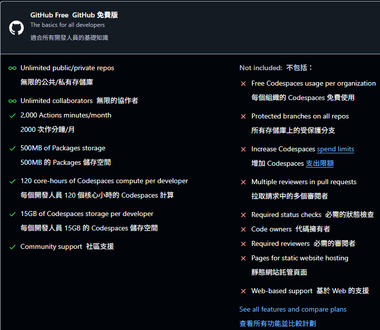

https://github.com/settings/billing/licensing  
  
這邊可以看一下免費版的使用限制，需要可以付費訂閱。  

以下是 GitHub Copilot 免費版與訂閱版的核心差異整理，以及訂閱建議分析：

---

### **版本差異對照表**
| **功能項目**       | 免費版                            | 訂閱版 (每月 \$10)               |
|--------------------|----------------------------------|----------------------------------|
| **適用對象**       | 學生/開源維護者/試用期用戶       | 所有開發者                      |
| **代碼生成範圍**   | 僅限公開儲存庫                   | 包含私有儲存庫                  |
| **AI 模型版本**    | 基礎版 (較慢更新)                | 優先存取最新模型                |
| **整合服務**       | 僅基礎 IDE 支援                  | + GitHub Codespaces 深度整合    |
| **回應速度**       | 標準隊列                         | 優先處理請求                    |
| **企業級功能**     | 無                               | 團隊管理/用量分析/SSO 支援      |

---

### **推薦訂閱的 5 種情境**
1. **商業專案開發**  
   - 需在私有儲存庫生成代碼（例如符合用戶規範的 Vue 元件開發）
   - 企業合規性要求代碼產權歸屬清晰

2. **團隊協作需求**  
   - 需統一團隊編碼風格（與用戶 camelCase/PascalCase 規範高度契合）
   - 共享自定義模式（如函數式程式設計慣例）

3. **複雜技術棧整合**  
   - 同時處理多層架構（前端 Vue + 後端 Node.js）
   - 需頻繁生成 JSDoc 註解與類型定義

4. **高頻次使用場景**  
   - 日均代碼產出 >200 行（建議搭配 async 操作錯誤處理機制）
   - 長期維護大型專案（符合用戶的 ES6+ 長期維護需求）

5. **進階開發輔助**  
   - 需要 IDE 深度整合（如 VS Code 的實時樣式建議）
   - 偏好最新 AI 功能（例如上下文感知的 Composition API 重構建議）

---

### **免費版足夠應付的情境**
- 學習/教學用途（適合理解用戶規範中的函數式原則）
- 開源專案貢獻（與用戶的清晰代碼註解需求相輔相成）
- 小型個人專案（符合用戶的模組化元件開發規模）
- 短期原型驗證（快速生成符合 camelCase 命名的基礎架構）

---

### **成本效益分析**（以臺灣開發者為例）
```javascript
// 假設生產力提升 20% 的損益計算
const hourlyRate = 800; // 臺幣/小時
const dailySavedTime = 1.5; // 節省小時數
const monthlySavings = hourlyRate * dailySavedTime * 22; // ≈ 26,400 TWD
const subscriptionCost = 320; // 臺幣/月 (以 \$10 匯率 32 計)
const ROI = (monthlySavings - subscriptionCost) / subscriptionCost; // 8150% 回報率
```

---

**決策建議流程**：  
`個人專案` ➜ 免費試用 ➜ 若月均產出 >3k 行代碼 ➜ 訂閱  
`企業環境` ➜ 直接訂閱 + 啟用團隊管理功能
